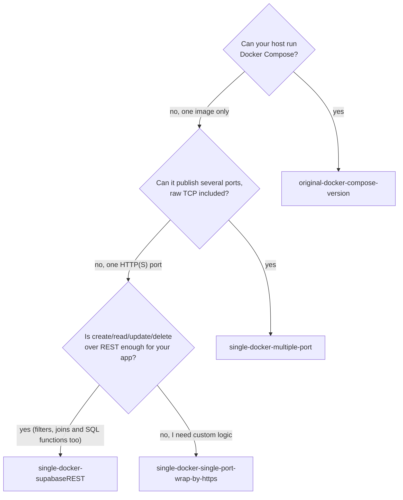

# Self-hosted Supabase adpation template: for restrictive hosting platforms

Four templates to run a self-hosted [Supabase](https://supabase.com/docs/guides/self-hosting) stack:

| Template | Runs as | Local Ports | Your app reaches its data with |
|---|---|---|---|
| [`original-docker-compose-version`](original-docker-compose-version) | ~11 containers, Docker Compose | HTTP 8000, pooler 5432 (session) / 6543 (transaction) | `postgres://` (role `app`, with the app overlay) |
| [`single-docker-multiple-port`](single-docker-multiple-port) | 1 image, supervisord | HTTP 9876, Postgres 5432, pooler 5433 / 6543 | `postgres://` (role `app`) |
| [`single-docker-single-port-wrap-by-https`](single-docker-single-port-wrap-by-https) | 1 image, supervisord | HTTP 9876 only | your own HTTP API |
| [`single-docker-supabaseREST`](single-docker-supabaseREST) | 1 image, supervisord | HTTP 9876 only | Supabase's REST API (PostgREST) |

## Which template to use for which hosting platform?

