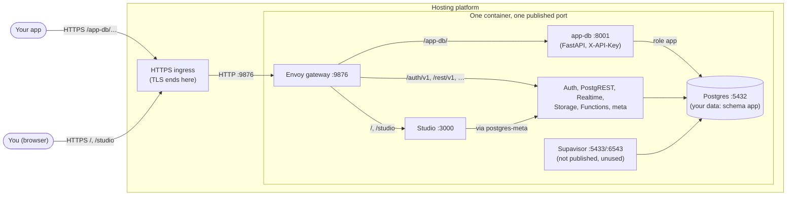

# Self-hosted Supabase: Template for one Docker image and one exposed HTTPS port

## Overview

This is Supabase's self-hosted stack in a **single Docker image** that
publishes **a single port**. Your app's data is wrapped in a small HTTP API,
`app-db`, so the app never needs a `postgres://` connection.

**Use it when your platform:**

- runs **one container** per app (no Docker Compose)
- publishes **one port** per container, through an **HTTP(S)-only ingress**




---

## Quick Start

You need Docker Desktop and `openssl`.

### Step 1: Config setting
```bash
cd single-docker-single-port-wrap-by-https
cp .env.example .env

sh utils/generate-keys.sh --update-env.  #generate every secret keys 
```

### Step 2: Build Docker Image
```bash
docker build -t supabase-single-port:v1 .
```

### Step 3: Run Dcoker Container
```bash
docker run -d --name supabase \
    --env-file .env \
    -p 9876:9876 \
    -v supabase-data:/home/supabase/data \
    supabase-single-port:v1
```

### Step 4: Healthy check 
Wait for "healthy" (about 20 s locally; longer on the very first start). Then:

```bash
docker exec supabase ./healthcheck.sh
```

### Step 5: Access the app 
You can try the app's data API:

```bash
APP_DB_API_KEY=$(grep '^APP_DB_API_KEY=' .env | cut -d= -f2-)

curl http://localhost:9876/app-db/health                               # {"status":"ok"}, no key needed
curl -X POST http://localhost:9876/app-db/items \
     -H "X-API-Key: $APP_DB_API_KEY" -H 'content-type: application/json' \
     -d '{"name": "first", "data": {"hello": "world"}}'
curl -H "X-API-Key: $APP_DB_API_KEY" http://localhost:9876/app-db/items
```

- **Supabas Studio:** <http://localhost:9876/studio> (or `/`). Log in with `DASHBOARD_USERNAME` / `DASHBOARD_PASSWORD`. Your tables are in the schema `app`.
- **Supabase's APIs:** `http://localhost:9876/rest/v1/<table>`, `/auth/v1/…`, … with the header `apikey: $ANON_KEY`. (The root `/rest/v1/` itself needs the service key.)

On the hosting platform, the same calls go to `https://your-domain.example.com/app-db/…`.

---

## Details

Postgres speaks its own binary protocol over TCP. An ingress that routes
HTTP requests by host name and path can't forward it, and the platform
publishes only that one port anyway.

So your app talks HTTP(S) to `app-db`, and `app-db` talks Postgres over the
container's loopback. The cost is that your app gets the operations `app-db`
offers, not arbitrary SQL. That is also what makes it safe on a public
address.

The gateway also serves other HTTP routes to the data:

| Route | What it is | When to use it |
|---|---|---|
| `/app-db/` | **Your own API** (this folder's `app-db/`) | Your app's private data, with your own rules, in schema `app` |
| `/rest/v1/` | PostgREST: an automatic REST API over the `public` schema | Data you protect with row-level security and the Supabase client libraries. The [`../single-docker-supabaseREST`](../single-docker-supabaseREST) variant builds on this route instead of `app-db`. |
| `/pg/` | postgres-meta: runs SQL over HTTP | Admin tooling only (service key) |

### `app-db/`, the HTTP wrapper

| File | What it is |
|---|---|
| `api.py` | The routes (FastAPI), the `X-API-Key` check, and error mapping (404, 409, 503) |
| `store.py` | Every query (SQLAlchemy). It runs Alembic `upgrade head` at startup, or on the first request if the database was still down. |
| `models.py` | The tables. The example is `items` (id, name, data JSON, timestamps). |
| `migrations/` | Alembic migrations (`versions/0001_initial_schema.py`) |
| `tests/` | API and store tests, on SQLite |

Routes:

| Method | Path | |
|---|---|---|
| GET | `/health` | Database reachable, schema current. No key needed. |
| POST | `/items` | Create (201) |
| GET | `/items?limit=&offset=` | Newest first |
| GET | `/items/{id}` | One item, or 404 |
| PATCH | `/items/{id}` | Change `name` and/or `data` |
| DELETE | `/items/{id}` | 204, also when the item is already gone |
| GET | `/docs`, `/redoc`, `/openapi.json` | Interactive docs. No key needed. |

How it is wired in:

- `services/app-db.sh` starts `uvicorn api:app` on `127.0.0.1:8001` with `--root-path /app-db`. It logs in as the role `app` (password `APP_DB_PASSWORD`, passed as `PGPASSWORD`).
- The `/app-db/` gateway route turns off the dashboard login and Supabase's key check, because `app-db` checks `X-API-Key` itself. The key is compared in constant time. With no key configured, every route that needs it answers 401, and `start-script.sh` refuses to start without `APP_DB_API_KEY` anyway.

**Make it yours:**

1. Replace `Item` in `models.py` with your tables.
2. Add a migration, in `app-db/`, against a scratch database that is at the latest revision (or write it by hand):

   ```bash
   cd app-db && uv sync
   export DATABASE_URL=sqlite:////tmp/app-db-scratch.sqlite3
   uv run alembic upgrade head
   uv run alembic revision --autogenerate --rev-id 0002 -m "…"
   ```
3. Replace the item methods in `store.py`, the item routes in `api.py`, and the tests in `tests/` (including the revision `0001` that `test_store.py` expects).
4. Run the tests locally: `uv run pytest`.
5. Rebuild the image. The schema is upgraded on the next start.

### Adding another service behind the gateway

`app-db` shows the pattern. A new service touches seven places:

1. `Dockerfile`: copy the program, and its runtime, into the image.
2. `services/<name>.sh`: sources `lib.sh`, calls `log_as` and `wait_for_db`, then `exec`s the program on `127.0.0.1`.
3. `supervisord.conf`: a `[program:<name>]` block, with its priority.
4. `services/lib.sh`: its port in the port table.
5. `config/envoy/cds.yaml`: a cluster on `127.0.0.1:<port>`, with a health check.
6. `config/envoy/lds.template.yaml`: a route, placed before `/api/mcp` and the catch-all `/` (Studio). A route that does its own auth, as `/app-db/` does, also needs the dashboard login (`basic_auth`) disabled and an RBAC override, or the gateway's global filters ask for the login and deny it.
7. `healthcheck.sh`: a check, so the container's health includes it, and the count in its last line.

### Gateway routes (one listener, port 9876)

| Path | Goes to | Needs |
|---|---|---|
| `/auth/v1/verify`, `/auth/v1/callback`, `/auth/v1/authorize`, `/auth/v1/.well-known/jwks.json`, `/auth/v1/sso/saml/{acs,metadata}`, and `/.well-known/oauth-authorization-server` (at the root) | Auth | nothing |
| `/auth/v1/` | Auth | `apikey` |
| `/rest/v1/`, `/graphql/v1` | PostgREST | `apikey` (root needs the service key) |
| `/realtime/v1/api` | Realtime's HTTP API | `apikey` |
| `/realtime/v1/` | Realtime (WebSocket) | `apikey` |
| `/storage/v1/` | Storage | its own JWT check |
| `/functions/v1/` | Edge runtime | optional JWT check |
| `/pg/` | postgres-meta | service key |
| **`/app-db/`** | **app-db** | **`X-API-Key`** |
| **`/studio`** | Studio's start page | dashboard login |
| `/realtime/v1/api/openapi`, `/realtime/v1/api/tenants`, `/mcp`, `/api/mcp` | — | blocked |
| `/` | Studio | dashboard login |

The table is grouped by service. In `config/envoy/lds.template.yaml`, routes
match in file order and the first match wins. Note the trailing slash:
`/app-db` without it falls through to Studio's login.

**Studio stays at `/`.** Its prebuilt image uses absolute paths for its pages
and assets, so `/studio` only leads into it: the gateway passes it to
Studio's `/`, which redirects to `/project/default`. Moving Studio itself
under a prefix would mean building it from source with
`NEXT_PUBLIC_BASE_PATH`.

### Ports inside the container

These are the same as in the multi-port image, plus `app-db`:

| Service | Port | Service | Port |
|---|---|---|---|
| **Gateway (published)** | **9876** | Storage / admin | 5000 / 5002 (not listening by default) |
| Studio | 3000 | imgproxy | 5001 |
| PostgREST / admin | 3001 / 3002 | postgres-meta | 8080 (and 8081) |
| Realtime | 4000 | **app-db** | **8001** |
| Supavisor API | 4001 | Edge runtime | 9000 |
| Postgres | 5432 | Auth | 9999 |
| Supavisor session / transaction | 5433 / 6543 | Envoy admin | 9901 |

> [!NOTE]
> The services' HTTP ports are written in two places: `services/lib.sh` and
> `config/envoy/cds.yaml`. Change both together. Postgres's and the pooler's
> ports are `.env` settings (`POSTGRES_PORT`, `POOLER_PROXY_PORT_*`), Envoy's
> admin port is in `config/envoy/envoy.yaml`, and 9876 is also in the
> `Dockerfile`'s `EXPOSE` and the `.env` URLs.

### Persistence volume

Mount persistent storage on **`/home/supabase/data`**:

| Path | What |
|---|---|
| `data/pgdata` | The whole database, your schema `app` included |
| `data/postgresql-custom` | Postgres's custom config and **pgsodium's root key** |
| `data/storage` | Files uploaded to Storage |
| `data/snippets` | Studio's saved SQL snippets |

Mount the volume on `data/`, not on `pgdata`. Keep `pgdata` and
`postgresql-custom` together.

### How to reset passsword?

The init SQL, including `config/db/migrations/99-app.sql`, which creates the
role `app`, runs only when `pgdata` is empty. After that, changing
`APP_DB_PASSWORD` in your settings doesn't change the role.

Change it in Postgres too (`alter role app password '…'` in Studio), then
recreate the container with the new value (`docker rm -f supabase`, then
`docker run …` again): `docker restart` keeps the old environment.
`APP_DB_API_KEY` is read whenever app-db starts, so a new value takes effect
as soon as the container is recreated with it.