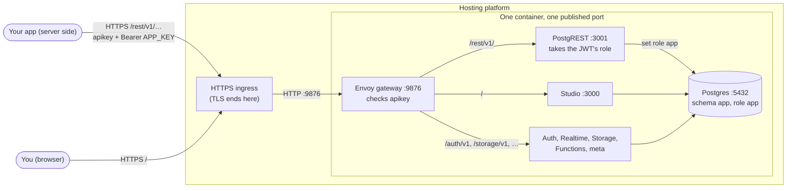

# Self-hosted Supabase: template for one Docker image, data through Supabase's REST API

## Overview

This is Supabase's self-hosted stack in a **single Docker image** that
publishes **a single HTTP port**. Your app reaches its tables through
**Supabase's REST API (PostgREST)** at `/rest/v1/`, with a key for a
dedicated role, `app`, whose rights are in its own schema, `app`.

**Use it when your platform:**
- runs **one container** per app (no Docker Compose)
- publishes **one port** per container, through an **HTTP(S)-only ingress**, so `postgres://` can't reach the container, **and**
- your app is happy with create/read/update/delete over HTTP, filters and joins included, and **no custom API code**.


---

## Quick Start
You need Docker Desktop and `openssl`.

### Step 1: Config settings 
```bash
cd single-docker-supabaseREST
cp .env.example .env

sh utils/generate-keys.sh --update-env.      # generate all secret keys
sh utils/app-key.sh.     # SUPABASE_ANON_KEY and APP_KEY. Put them in your app's settings.
```

### Step 2: Build Docker Image
```bash
docker build -t supabase-rest:v1 .
```

### Step 3: Run Docker container 
```bash
docker run -d --name supabase \
    --env-file .env \
    -p 9876:9876 \
    -v supabase-data:/home/supabase/data \
    supabase-rest:v1
```


### Step 4: Healthy check
Wait for "healthy" (about 20 s locally; longer on the very first start).
```bash
docker exec supabase ./healthcheck.sh    
```

### Step 5: Access the app
Try your app's data, in the example table `items`:

```bash
ANON_KEY=$(grep '^ANON_KEY=' .env | cut -d= -f2-)
APP_KEY=$(sh utils/app-key.sh | sed -n 's/^APP_KEY=//p')

# Create one row
curl -X POST http://localhost:9876/rest/v1/items \
     -H "apikey: $ANON_KEY" -H "Authorization: Bearer $APP_KEY" \
     -H "Content-Profile: app" -H "Content-Type: application/json" \
     -H "Prefer: return=representation" \
     -d '{"name": "first", "data": {"hello": "world"}}'

# Read them back
curl "http://localhost:9876/rest/v1/items?select=id,name,data&order=created_at.desc" \
     -H "apikey: $ANON_KEY" -H "Authorization: Bearer $APP_KEY" -H "Accept-Profile: app"
```

Every request carries three things:

| Header | Why |
|---|---|
| `apikey: <ANON_KEY>` | The gateway lets through only requests with one of Supabase's keys. |
| `Authorization: Bearer <APP_KEY>` | PostgREST switches to the role the JWT names: `app`. |
| `Accept-Profile: app` (reads) or `Content-Profile: app` (writes) | Picks the schema; the default is `public`. |

- **Studio:** <http://localhost:9876>. Log in with `DASHBOARD_USERNAME` / `DASHBOARD_PASSWORD`. Your tables are in the schema `app`.
- On the platform, the same calls go to `https://your-domain.example.com/rest/v1/…`.

---

## Details

### Why the REST API, and not `postgres://` or a custom API?

Postgres speaks its own binary protocol over TCP. An ingress that routes HTTP
requests by host name and path can't forward it, and the platform publishes
only one port anyway. So the data has to travel over HTTP.

One way is to write your own HTTP API in front of the database, as the
wrap-by-https variant does. But Supabase already ships one: **PostgREST**
turns every table, view and function in a schema into REST endpoints, with
filtering, ordering, paging, joins (`select=*,other_table(*)`) and RPC calls
(`/rest/v1/rpc/<function>`). The only missing piece is isolation: by default
it serves `public`, to anyone who holds the anon key.


### Your tables: `config/app-schema/`

`services/schema.sh` runs at every start, after Postgres is up. It:

1. creates the role `app` and the schema `app`, if they're missing;
2. creates `app.schema_migrations`, the list of files applied so far;
3. applies each `config/app-schema/*.sql` file not in that list, in name order. Each file runs in one transaction, as the role `app`, with `search_path = app`, and is recorded once it succeeds.

`healthcheck.sh` reports `schema` until the newest file is recorded, so a failed
migration shows as an unhealthy container. Its error is in `docker logs`,
prefixed with `[schema]`. Fix the file, rebuild, and start again.

**Make it yours:**

1. Replace `0001_example.sql` with your tables, before the first start. After that, never edit a file that a database has had: add `0002_<what>.sql`.
2. Rebuild the image. The new files are applied on the next start, also to a database that already exists.
3. Optionally, add views and SQL functions. PostgREST serves views as tables, and functions at `/rest/v1/rpc/<name>`.

`0001_example.sql` also shows, commented out, how to let users signed in with
Supabase Auth reach their own rows, with row-level security. It needs one
extra grant in `services/schema.sh`, described there.

### Keys

| Key | Who holds it | What it can reach |
|---|---|---|
| `ANON_KEY` | anyone (it is public by design) | gets through the gateway; on its own, only what the role `anon` is granted (in `public`, under row-level security), plus signing up and in with Auth |
| `APP_KEY` (`utils/app-key.sh`) | **your app's server only** | everything in the schema `app`, through `/rest/v1/` |
| `SERVICE_ROLE_KEY` | admins only | through `/rest/v1/`, everything except the schema `app` (it bypasses row-level security); through `/pg/`, any SQL on the whole database, `app` included. Treat it like the database password. |

`APP_KEY` is a JWT, `{"role": "app", "iss": "supabase"}`, valid 5 years, with
no user in it. Running `generate-keys.sh` again changes `JWT_SECRET`, which
invalidates every key, but it also changes `POSTGRES_PASSWORD` and the
encryption keys, which an existing database doesn't take (see below). To
rotate only the keys, change `JWT_SECRET`, `ANON_KEY` and `SERVICE_ROLE_KEY`,
then run `app-key.sh` again and update your app.

### Gateway routes (one listener, port 9876)

| Path | Goes to | Needs |
|---|---|---|
| `/auth/v1/verify`, `/auth/v1/callback`, `/auth/v1/authorize`, `/auth/v1/.well-known/jwks.json`, `/auth/v1/sso/saml/{acs,metadata}`, and `/.well-known/oauth-authorization-server` (at the root) | Auth | nothing |
| `/auth/v1/` | Auth | `apikey` |
| **`/rest/v1/`** | **PostgREST**: your data, with `APP_KEY` as Bearer | `apikey` (the root `/rest/v1/` needs the service key) |
| `/graphql/v1` | PostgREST's GraphQL (`graphql_public`, which `app` isn't granted) | `apikey` |
| `/realtime/v1/api` | Realtime's HTTP API | `apikey` |
| `/realtime/v1/` | Realtime (WebSocket) | `apikey` |
| `/storage/v1/` | Storage | its own JWT check |
| `/functions/v1/` | Edge runtime | optional JWT check, then the function's own |
| `/pg/` | postgres-meta: any SQL | service key |
| `/realtime/v1/api/openapi`, `/realtime/v1/api/tenants`, `/mcp`, `/api/mcp` | — | blocked |
| `/` | Studio | dashboard login |

The gateway's config (`config/envoy/`) is the multi-port image's, unchanged.
Routes match in the file's order, and the first match wins.

### Files

| File | What it does |
|---|---|
| `Dockerfile` | One stage per service image, plus one that rebuilds Storage's native module for glibc. Each program is copied onto `debian:trixie-slim`, and `config/app-schema/` to `/etc/app-schema/migrations/`. `EXPOSE 9876` only. |
| `start-script.sh` | The `CMD`. Checks the required settings, prepares the data folder, then `exec supervisord`. |
| `supervisord.conf` | The 11 services, plus the one-shot `schema` program (priority 15, right after the database). |
| `services/schema.sh` | Creates the role and schema `app`, and applies `config/app-schema/`. |
| `services/rest.sh` | PostgREST, with `app` always added to `PGRST_DB_SCHEMAS`. |
| `services/lib.sh` | The settings loader, the **port table**, `log_as`, `wait_for_db`. |
| `healthcheck.sh` | The 11 services, plus "is the newest schema file applied?". |
| `config/app-schema/` | Your tables, as numbered SQL files. |
| `config/envoy/`, `config/db/`, `config/pooler.exs`, `functions/` | As in the multi-port image, minus its `config/db/migrations/99-app.sql`. |
| `utils/generate-keys.sh`, `utils/app-key.sh` | Every secret into `.env`, and your app's two keys (neither script is copied into the image). |

### Ports inside the container

| Service | Port | Service | Port |
|---|---|---|---|
| **Gateway (published)** | **9876** | Storage / admin | 5000 / 5002 (not listening by default) |
| Studio | 3000 | imgproxy | 5001 |
| PostgREST / admin | 3001 / 3002 | postgres-meta | 8080 (and 8081) |
| Realtime | 4000 | Edge runtime | 9000 |
| Supavisor API | 4001 | Auth | 9999 |
| Postgres | 5432 | Envoy admin | 9901 |
| Supavisor session / transaction | 5433 / 6543 | | |

> [!NOTE]
> The services' HTTP ports are written in two places: `services/lib.sh` and
> `config/envoy/cds.yaml`. Change both together. Postgres's and the pooler's
> ports are `.env` settings (`POSTGRES_PORT`, `POOLER_PROXY_PORT_*`), Envoy's
> admin port is in `config/envoy/envoy.yaml`, and 9876 is also in the
> `Dockerfile`'s `EXPOSE` and the `.env` URLs.

### Persistence Volume

Mount persistent storage on **`/home/supabase/data`**:

| Path | What |
|---|---|
| `data/pgdata` | The whole database, your schema `app` included |
| `data/postgresql-custom` | Postgres's custom config and **pgsodium's root key** |
| `data/storage` | Files uploaded to Storage |
| `data/snippets` | Studio's saved SQL snippets |

Mount the volume on `data/`, not on `pgdata`. Keep `pgdata` and
`postgresql-custom` together.

### How to reset passwords

Supabase's init SQL (`config/db/`) runs only when `pgdata` is empty, so
changing `POSTGRES_PASSWORD` later doesn't change the database: change it in
Postgres too, for each role it is set on (`postgres`, `supabase_admin`,
`authenticator`, `pgbouncer`, `supabase_auth_admin`,
`supabase_functions_admin`, `supabase_storage_admin`). The role `app` has no
password at all, so only the keys matter for your app, and PostgREST checks
them against the current `JWT_SECRET`. After changing settings, recreate the
container (`docker rm -f`, then `docker run` again): `docker restart` keeps
the old environment.
